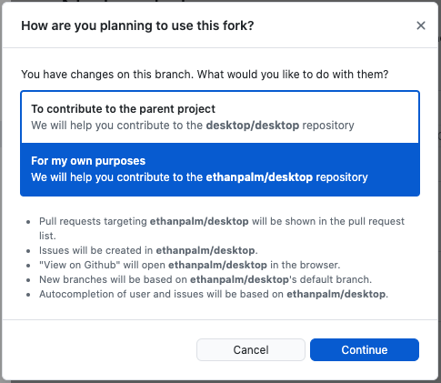

### Intro to Computer Science - Basic HTML

#### Prepare

Unsure about gitHub?
→ Review [Version Control with Git and GitHub](https://redi-school.github.io/ber-dcp-intro-to-computer-science/docs/git/git_and_github_desktop/) lesson.

In `GitHub Desktop` clone this repository: https://github.com/ReDI-School/ber-intro-to-cs-2021-html-journal

  
"How are you planning to use this fork?"

    
    Select For my own purposes
    

#### See your changes

- you can open the folder in your finder/explorer and double click on index.html (disadvantage: every time you make changes you have to reload the page)
- `Live Server` is a great tool to see your changes in real time (you should have installed it at the beginning)
- Every time you save your website will automatically get the newest changes
- To start the Live Server either right click in the root index.html file and select **Start Live Server** or click on **Go Live** in the bar at the bottom - when it is running it will say `Port: 5500` there - always leave it running to see the changes.

### Add HTML to display general journal information and clickable list of years

- [ ] Open `index.html`
- [ ] Add HTML markup to:
  - [ ] Add the basic html skeleton
  - [ ] Display a page title for your journal
  - [ ] Display a header for your journal
  - [ ] Add an image to your header
  - [ ] Display a list of clickable years (2020 and 2021)

### Add HTML to display general information for a year's journal entries and clickable list of months

- [ ] Open the 2020 Journal page `2020/index.html`
- [ ] Add HTML markup to:
  - [ ] Display a page title indicating the year
  - [ ] Display a header indicating the year
  - [ ] Display a list of clickable months in the year (December)
- [ ] Repeat the previous steps for 2021 in the `2021/index.html` file

### Add HTML to display general information for a month's journal entries and clickable list of days

- [ ] As an example, open the March 2021 Journal page `2021/march/index.html`
- [ ] Add HTML markup to:
  - [ ] Display a page title indicating the month and year
  - [ ] Display a header indicating the month and year
- [ ] Repeat the previous steps for all other months across your journal

### Add a single daily journal page in March 2021

- [ ] Go to the `2021/march` folder
- [ ] Create a new file 25.html
- [ ] Add HTML markup to:
  - [ ] Display a page title indicating 25th March 2021
  - [ ] Display a header indicating the day, month and year (25th March 2021)
  - [ ] Display an image or youtube video you like
  - [ ] Display any journal text you like
- [ ] Go to the `2021/march/index.html` page
- [ ] Add HTML markup to:
  - [ ] Display a link to the journal page for 25th march 2021 (`2021/march/25.html`)

### Push (upload) your work to github

- In GitHub Desktop create a new branch
- Click on `New Terminal`
- Run the following command to create a new branch
  - `git checkout -b my-html-work`
- Run the following command to prepare all the files to be uploaded to github
  - `git add .` (don't forget the "dot")
- Run the following commit the changes to the local git branch on your laptop
  - `git commit -m "my html file changes"`
- Run the following command to upload your local git branch to your github fork which is on the internet
  - `git push -u origin my-html-work`
- Open a Github pull request from your `my-html-work` branch to the main branch of your fork `main` or `master`
- Merge the pull request
- Victory!

## Further Resources:

### Publish to github pages

- so far our website is only a local file
- to share a link that others can visit we need to host our pages somewhere, luckily gitHub has a option called `GitHub Pages` to host our repository files on the internet
- now every time you push to your main branch, your files will be deployed to github pages
  [Read about getting started with GitHub Pages](https://docs.github.com/en/pages/getting-started-with-github-pages/creating-a-github-pages-site)
